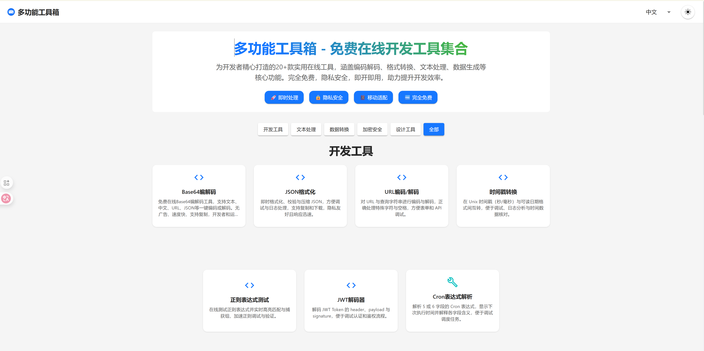

# 多功能工具箱

## 📁 项目结构
```
tool-sites/
├── toolbox-frontend # 前端页面
│   ├── dist
│   │   └── assets
│   ├── public
│   └── src
│       ├── assets
│       ├── components
│       │   ├── Dashboard
│       │   └── tools
│       ├── config
│       ├── hooks
│       ├── i18n
│       └── utils
└── toolbox-ts-backend # 后端
    ├── database
    └── src
        ├── endpoints
        │   └── questionnaire
        ├── services
        └── types
```

## 🎨 设计特色

- **10+在线工具**：Base64编解码、Cron解析、图片压缩、水印等
- **前后端分离**：Pages部署前端，Workers部署后端 API
- **持久化存储**：D1数据库存储数据
- **0成本上线**：全部运行在Cloudflare免费额度内
- **开源透明**：方便查看源码


## 🔧 本地部署

0. fork项目到自己的仓库中，然后克隆到本地
1. 在Cloudflare的Wokers和Pages使用该项目创建
2. 本地修改[wrangler.jsonc](toolbox-ts-backend/wrangler.jsonc)中FRONTEND_DOMAIN，增加自己项目中Pages的地址，用于放通CROS校验
3. 在Cloudflare的Pages->设置->变量和机密，添加类型：文本；变量名称：API_URL；变量值：Workers地址（如：https://toolifyhub-backend.xxx.workers.dev）
4. 推送代码重新部署
5. 打开Pages地址即可正常访问

## 🤝 贡献

欢迎提交 Issue 和 Pull Request 来帮助改进 [多功能工具箱](https://toolifyhub.top/)

你可以通过以下方式参与项目：
- 提交bug报告和功能建议
- 改进文档和代码
- 分享使用体验和反馈