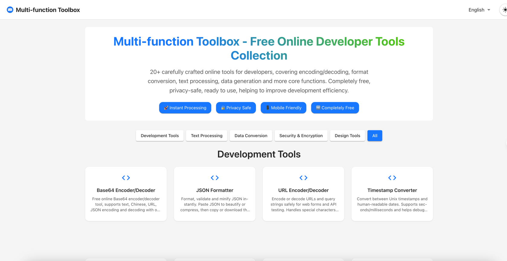

# Multi-functional Toolbox

[](https://github.com/Mayi21/tool-sites/stargazers)
[](https://github.com/Mayi21/tool-sites/network)
[](https://github.com/Mayi21/tool-sites/issues)
[](https://opensource.org/licenses/MIT)
[](https://workers.cloudflare.com/)

[English](README.md) | [中文](README_zh.md)



## 🚀 Quick Start

### Prerequisites

- Node.js >= 16.x
- npm or yarn
- Cloudflare account (for deployment)
- Git

### Installation

1. **Clone the repository**
```bash
git clone https://github.com/Mayi21/tool-sites.git
cd tool-sites
```

2. **Install frontend dependencies**
```bash
cd toolbox-frontend
npm install
# or
yarn install
```

3. **Install backend dependencies**
```bash
cd ../toolbox-ts-backend
npm install
# or
yarn install
```

4. **Local development**
```bash
# Frontend development (in toolbox-frontend directory)
npm run dev

# Backend development (in toolbox-ts-backend directory)
npm run dev
```

## 📁 Project Structure
```
tool-sites/
├── toolbox-frontend # Frontend pages
│   ├── dist
│   │   └── assets
│   ├── public
│   └── src
│       ├── assets
│       ├── components
│       │   ├── Dashboard
│       │   └── tools
│       ├── config
│       ├── hooks
│       ├── i18n
│       └── utils
└── toolbox-ts-backend # Backend
    ├── database
    └── src
        ├── endpoints
        │   └── questionnaire
        ├── services
        └── types
```

## 🎨 Features

- **10+ Online Tools**: Base64 encode/decode, Cron parser, image compression, watermarking, and more
- **Separation of Concerns**: Frontend deployed on Pages, backend API on Workers
- **Persistent Storage**: Data stored in D1 database
- **Zero-cost Deployment**: Runs entirely within Cloudflare's free tier
- **Open Source**: Transparent source code

## 🔧 Environment Variables

### Frontend Environment Variables

Create a `.env` file in the `toolbox-frontend` directory:

```bash
# API backend URL
VITE_API_URL=https://your-backend.workers.dev

# Other configurations (as needed)
VITE_APP_TITLE=Multi-functional Toolbox
```

### Backend Environment Variables

Configure in `wrangler.jsonc` in the `toolbox-ts-backend` directory:

```json
{
  "name": "toolbox-backend",
  "main": "src/index.ts",
  "compatibility_date": "2023-05-18",
  "vars": {
    "FRONTEND_DOMAIN": "https://your-frontend.pages.dev"
  }
}
```

### Cloudflare Pages Environment Variables

Set in Cloudflare Pages console:

| Variable Name | Description | Example |
|---------------|-------------|---------|
| `API_URL` | Workers API URL | `https://toolbox-backend.xxx.workers.dev` |
| `NODE_VERSION` | Node.js version | `18` |

## 🔧 Deployment

0. Fork this repository to your own account, then clone locally
1. Create new projects in Cloudflare Workers and Pages using this repository
2. Modify `FRONTEND_DOMAIN` in [wrangler.jsonc](toolbox-ts-backend/wrangler.jsonc) locally, add your Pages URL for CORS validation
3. In Cloudflare Pages -> Settings -> Environment variables, add: Type: Text; Variable name: API_URL; Variable value: Workers URL (e.g., https://toolifyhub-backend.xxx.workers.dev)
4. Push code to redeploy
5. Open the Pages URL to access normally

## 🤝 Contributing

Welcome to submit Issues and Pull Requests to help improve [Multi-functional Toolbox](https://toolifyhub.top/)

You can contribute to the project by:
- Submitting bug reports and feature suggestions
- Improving documentation and code
- Sharing usage experiences and feedback