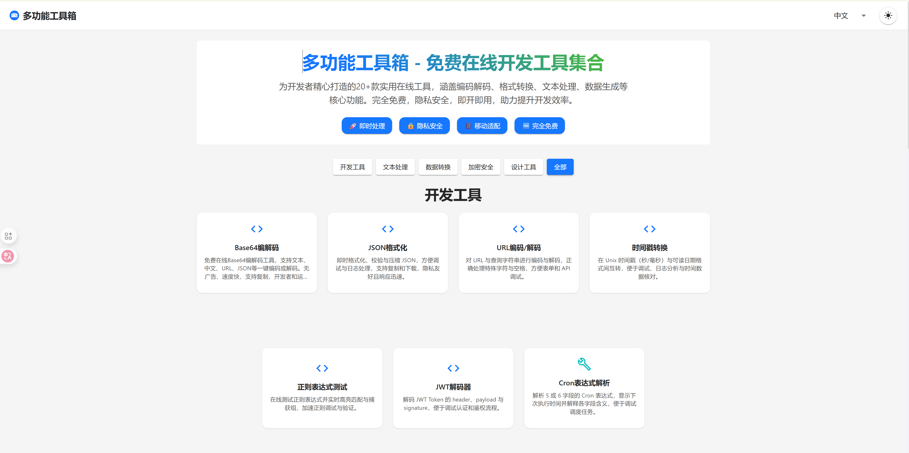

# 多功能工具箱

[English](README.md) | [中文](README_zh.md)

[](https://github.com/Mayi21/tool-sites/stargazers)
[](https://github.com/Mayi21/tool-sites/network)
[](https://github.com/Mayi21/tool-sites/issues)
[](https://opensource.org/licenses/MIT)
[](https://workers.cloudflare.com/)



## 🚀 快速开始

### 前提条件

- Node.js >= 16.x
- npm 或 yarn
- Cloudflare 账号（用于部署）
- Git

### 安装步骤

1. **克隆仓库**
```bash
git clone https://github.com/Mayi21/tool-sites.git
cd tool-sites
```

2. **安装前端依赖**
```bash
cd toolbox-frontend
npm install
# 或
yarn install
```

3. **安装后端依赖**
```bash
cd ../toolbox-ts-backend
npm install
# 或
yarn install
```

4. **本地开发**
```bash
# 前端开发（在toolbox-frontend目录）
npm run dev

# 后端开发（在toolbox-ts-backend目录）
npm run dev
```

## 📁 项目结构
```
tool-sites/
├── toolbox-frontend # 前端页面
│   ├── dist
│   │   └── assets
│   ├── public
│   └── src
│       ├── assets
│       ├── components
│       │   ├── Dashboard
│       │   └── tools
│       ├── config
│       ├── hooks
│       ├── i18n
│       └── utils
└── toolbox-ts-backend # 后端
    ├── database
    └── src
        ├── endpoints
        │   └── questionnaire
        ├── services
        └── types
```

## 🎨 设计特色

- **10+在线工具**：Base64编解码、Cron解析、图片压缩、水印等
- **前后端分离**：Pages部署前端，Workers部署后端 API
- **持久化存储**：D1数据库存储数据
- **0成本上线**：全部运行在Cloudflare免费额度内
- **开源透明**：方便查看源码

## 🔧 环境变量配置

### 前端环境变量

在 `toolbox-frontend` 目录创建 `.env` 文件：

```bash
# API后端地址
VITE_API_URL=https://your-backend.workers.dev

# 其他配置（根据实际需要）
VITE_APP_TITLE=多功能工具箱
```

### 后端环境变量

在 `toolbox-ts-backend` 目录的 `wrangler.jsonc` 中配置：

```json
{
  "name": "toolbox-backend",
  "main": "src/index.ts",
  "compatibility_date": "2023-05-18",
  "vars": {
    "FRONTEND_DOMAIN": "https://your-frontend.pages.dev"
  }
}
```

### Cloudflare Pages 环境变量

在 Cloudflare Pages 控制台设置：

| 变量名 | 描述 | 示例值 |
|--------|------|--------|
| `API_URL` | Workers API地址 | `https://toolbox-backend.xxx.workers.dev` |
| `NODE_VERSION` | Node.js版本 | `18` |

## 🔧 本地部署

0. fork项目到自己的仓库中，然后克隆到本地
1. 在Cloudflare的Wokers和Pages使用该项目创建
2. 本地修改[wrangler.jsonc](toolbox-ts-backend/wrangler.jsonc)中FRONTEND_DOMAIN，增加自己项目中Pages的地址，用于放通CROS校验
3. 在Cloudflare的Pages->设置->变量和机密，添加类型：文本；变量名称：API_URL；变量值：Workers地址（如：https://toolifyhub-backend.xxx.workers.dev）
4. 推送代码重新部署
5. 打开Pages地址即可正常访问

## 🤝 贡献

欢迎提交 Issue 和 Pull Request 来帮助改进 [多功能工具箱](https://toolifyhub.top/)

你可以通过以下方式参与项目：
- 提交bug报告和功能建议
- 改进文档和代码
- 分享使用体验和反馈